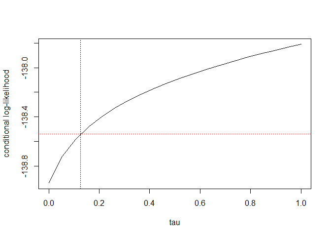

AUGglmmTMB
================

## Overview

`AUGglmmTMB` is an R package for the analysis of binomial mixed models
in settings with sparse and clustered data. It provides methods for
stable estimation in the presence of separation and boundary estimates
of random effects covariance matrices.

The package implements penalized likelihood approaches based on
extensions of Firth-type penalty for the fixed effects and Inverse
Wishart type penalty for the random effects covariance matrix through
data augmentation techniques as presented in Košuta et al. These methods
ensure finite and interpretable parameter estimates while preserving
desirable statistical properties such as parameterization invariance.

## Motivation

In many applied settings, particularly in clinical and epidemiological
research, data are sparse and structured hierarchically. Standard
maximum likelihood estimation in binomial mixed models may fail due to:

- separation in binary or count outcomes,
- rare events or rare exposures,
- boundary estimates of variance components.

These issues lead to unstable estimation and invalid inference.
`AUGglmmTMB` provides practical tools to address these challenges within
a unified framework.

## Features

- Penalized likelihood estimation for GLMMs based on Firth-type
  corrections  
- Data augmentation approaches for stable estimation  
- Handling of separation in clustered data  
- Regularization of random effects covariance parameters  
- Compatibility with `glmmTMB` workflows

## Key Functions

- `AUGglmmTMB()`: fits penalized binomial mixed models using iterative
  algorithms based on Košuta et al. The function supports penalties on
  both fixed and random effects and provides stable estimation in the
  presence of separation and boundary estimates.

- `mpl_fitter()`: fits penalized binomial mixed models using iterative
  algorithms based on Košuta et al. The function supports penalties on
  both fixed and random effects and provides stable estimation in the
  presence of separation and boundary estimates.

- `get_psi()`: estimates penalty parameters for the random-effects
  covariance structure using an iterative procedure consistent with the
  penalized likelihood framework.

- `get_data_plot_cloglik()`: evaluates the conditional log-likelihood
  over a grid of shrinkage parameters for the random-effects covariance
  matrix, supporting data-driven selection of the penalty strength
  obtained using `get_psi()`.

## Installation

You can install the development version from GitHub:

`install.packages("remotes");remotes::install_github("rokblagus/AUGglmmTMB")`

## Examples

The functionality of the package is illustrated using a dataset on
European passerine birds, originally published by Bandelj et al. The
data used in their study included additional sampling to address the
separation issue. In contrast, the dataset `data(birds)` provided with
this R package corresponds to the original dataset, prior to this
additional sampling.

First, we fit the model using ML, as implemented in the R package
`glmmTMB`, using the default settings.

``` r
library(glmmTMB)
```

    ## Warning: package 'glmmTMB' was built under R version 4.4.3

``` r
library(AUGglmmTMB)
data(birds)
fit_ml<-glmmTMB(parasites~migration+food+(migration|phylogenetic)+(1|species),data=birds,family=binomial(link = "logit"))
```

    ## Warning in finalizeTMB(TMBStruc, obj, fit, h, data.tmb.old): Model convergence
    ## problem; singular convergence (7). See vignette('troubleshooting'),
    ## help('diagnose')

``` r
summary(fit_ml)
```

    ##  Family: binomial  ( logit )
    ## Formula:          
    ## parasites ~ migration + food + (migration | phylogenetic) + (1 |      species)
    ## Data: birds
    ## 
    ##       AIC       BIC    logLik -2*log(L)  df.resid 
    ##     315.6     350.7    -148.8     297.6       357 
    ## 
    ## Random effects:
    ## 
    ## Conditional model:
    ##  Groups       Name        Variance Std.Dev. Corr  
    ##  phylogenetic (Intercept) 0.03439  0.1854         
    ##               migration   0.75955  0.8715   -1.00 
    ##  species      (Intercept) 0.39084  0.6252         
    ## Number of obs: 366, groups:  phylogenetic, 8; species, 42
    ## 
    ## Conditional model:
    ##               Estimate Std. Error z value Pr(>|z|)
    ## (Intercept)   -1.84896        NaN     NaN      NaN
    ## migration     -1.87632        NaN     NaN      NaN
    ## foods       -326.00895        NaN     NaN      NaN
    ## foodv          2.36462        NaN     NaN      NaN
    ## foodz         -0.07317        NaN     NaN      NaN

Due to the separation issue, the coefficient for `foods` is
unreasonable. The estimated random effects covariance matrix at the
level of `phylogenetic` is on the boundary of the parameter space, as
evident by the correlation parameter `Corr` estimated at -1.
Furtheremore, the standar errors cannot be computed for any of the
model’s parameters.

``` r
fit_ml$sdr
```

    ## sdreport(.) result
    ##            Estimate Std. Error
    ## beta    -1.84896183        NaN
    ## beta    -1.87632269        NaN
    ## beta  -326.00895307        NaN
    ## beta     2.36462228        NaN
    ## beta    -0.07317489        NaN
    ## theta   -1.68505042        NaN
    ## theta   -0.13751309        NaN
    ## theta -371.21301045        NaN
    ## theta   -0.46972634        NaN
    ## Maximum gradient component: 6.988847e-05

To solve these issues, we fit the model using MPL, using the default
penalty for the fixed effects penalty, inverse-Wishart penalty with
$\nu=3$ and $\Psi=I_2$ ($2\times 2$ identity matrix) for the random
effects covariance matrix at the level of `phylogenetic` and no penalty
for the random effects covariance by `species`. We use Algorithm 1 from
Košuta et al.

``` r
fit_mpl_1<-AUGglmmTMB(parasites~migration+food+(migration|phylogenetic)+(1|species),data=birds,link = "logit",
                penOpt = AUGglmmTMBPenalty(autrepen =FALSE,nu=list(3),psi=list(diag(1,2,2))),
                      control=AUGglmmTMBControl(fit_pGLM = FALSE,maxiter = 50,tol=1e-5,save_coef=TRUE)   )
summary(fit_mpl_1$fit)
```

    ##  Family: binomial  ( logit )
    ## Formula:          
    ## cbind(Y, M - Y) ~ -1 + X + (-1 + Z1 | grouping1) + (-1 + Z2 |      grouping2)
    ## Data: xdfa
    ## 
    ##       AIC       BIC    logLik -2*log(L)  df.resid 
    ##        NA        NA        NA        NA       369 
    ## 
    ## Random effects:
    ## 
    ## Conditional model:
    ##  Groups    Name          Variance Std.Dev. Corr  
    ##  grouping1 Z1(Intercept) 0.1521   0.3900         
    ##            Z1migration   0.1667   0.4083   -0.01 
    ##  grouping2 Z2            0.4047   0.6362         
    ## Number of obs: 378, groups:  grouping1, 14; grouping2, 48
    ## 
    ## Conditional model:
    ##              Estimate Std. Error z value Pr(>|z|)    
    ## X(Intercept) -2.03708    0.41456  -4.914 8.93e-07 ***
    ## Xmigration   -1.38674    1.12537  -1.232   0.2179    
    ## Xfoods       -1.16066    3.14539  -0.369   0.7121    
    ## Xfoodv        2.30036    1.37073   1.678   0.0933 .  
    ## Xfoodz       -0.01398    0.51790  -0.027   0.9785    
    ## ---
    ## Signif. codes:  0 '***' 0.001 '**' 0.01 '*' 0.05 '.' 0.1 ' ' 1

The coefficient for `foods` is now more reasonable, with the random
effects covariance matrix at the level of `phylogenetic` estimated away
from the boundary. Unlike for ML, the standard errors for model’s
parameters can now be computed. However, there is still an issue with
the SE for one of the random effects parameters, implying that the
chosen prior for the random effects is not optimal.

``` r
fit_mpl_1$fit$sdr
```

    ## sdreport(.) result

    ## Warning in sqrt(diag(object$cov.fixed)): NaNs produced

    ##           Estimate Std. Error
    ## beta  -2.037080608  0.4145640
    ## beta  -1.386743264  1.1253655
    ## beta  -1.160664560  3.1453934
    ## beta   2.300355740  1.3707279
    ## beta  -0.013983021  0.5179034
    ## theta -0.941644111  0.8747730
    ## theta -0.895649404  0.9383115
    ## theta -0.008254969        NaN
    ## theta -0.452251391  0.4641996
    ## Warning:
    ## Hessian of fixed effects was not positive definite.
    ## Maximum gradient component: 0.7870137

Therefore, we use the data-driven procedure proposed by Košuta et al.,
to determine the penalty parameters for the random effects penalty.

``` r
fit_mpl_2<-AUGglmmTMB(parasites~migration+food+(migration|phylogenetic)+(1|species),data=birds,link = "logit",
                penOpt = AUGglmmTMBPenalty(autrepen =TRUE,plot=TRUE,ntaus=20),
                      control=AUGglmmTMBControl(fit_pGLM = FALSE,maxiter = 50,tol=1e-5,save_coef=TRUE)   )
```

<!-- -->

The value of $\nu$ used by this data-driven procedure is equal to
$\nu=2q-1$, as suggested by Košuta et al. The plot produced by
`plot=TRUE,ntaus=20`, shows the conditional likelihood as a function of
$\tau$, with the blue vertical line denoting the chosen value of $\tau$.
Using this data-driven penalty

``` r
fit_mpl_2$optre
```

    ## $tau
    ## [1] 0.1263475
    ## 
    ## $psi
    ##            [,1]      [,2]
    ## [1,]  0.9282133 -0.821665
    ## [2,] -0.8216650  4.726479

the standard errors are now available for all model’s parameters

``` r
fit_mpl_2$fit$sdr
```

    ## sdreport(.) result
    ##          Estimate Std. Error
    ## beta  -1.95661642  0.6063953
    ## beta  -1.54886063  1.4027587
    ## beta  -0.88187973  3.3832993
    ## beta   2.21991850  1.5328207
    ## beta  -0.06669382  0.5688629
    ## theta -0.97591115  0.8601511
    ## theta -0.12681709  0.9632248
    ## theta -0.44217196  3.8686397
    ## theta -0.48511012  0.4892041
    ## Maximum gradient component: 0.915568

``` r
summary(fit_mpl_2$fit)
```

    ##  Family: binomial  ( logit )
    ## Formula:          
    ## cbind(Y, M - Y) ~ -1 + X + (-1 + Z1 | grouping1) + (-1 + Z2 |      grouping2)
    ## Data: xdfa
    ## 
    ##       AIC       BIC    logLik -2*log(L)  df.resid 
    ##     334.3     369.8    -158.2     316.3       369 
    ## 
    ## Random effects:
    ## 
    ## Conditional model:
    ##  Groups    Name          Variance Std.Dev. Corr  
    ##  grouping1 Z1(Intercept) 0.142    0.3768         
    ##            Z1migration   0.776    0.8809   -0.40 
    ##  grouping2 Z2            0.379    0.6156         
    ## Number of obs: 378, groups:  grouping1, 14; grouping2, 48
    ## 
    ## Conditional model:
    ##              Estimate Std. Error z value Pr(>|z|)   
    ## X(Intercept) -1.95662    0.60640  -3.227  0.00125 **
    ## Xmigration   -1.54886    1.40276  -1.104  0.26953   
    ## Xfoods       -0.88188    3.38330  -0.261  0.79436   
    ## Xfoodv        2.21992    1.53282   1.448  0.14755   
    ## Xfoodz       -0.06669    0.56886  -0.117  0.90667   
    ## ---
    ## Signif. codes:  0 '***' 0.001 '**' 0.01 '*' 0.05 '.' 0.1 ' ' 1

We now use a computationally more efficient approximation of MPL, based
on a single iteration of Algorithm 2 in Košuta et al.

``` r
fit_mpl_3<-AUGglmmTMB(parasites~migration+food+(migration|phylogenetic)+(1|species),data=birds,link = "logit",
                penOpt = AUGglmmTMBPenalty(autrepen =TRUE,plot=TRUE,ntaus=20),
                      control=AUGglmmTMBControl(fit_pGLM = TRUE,maxiter = 1,tol=1e-5,save_coef=TRUE)   )
```

<!-- -->

which gives very similar results as the exact implementation based on
Algorithm 1: the difference between the two procedures relative to the
SE obtained by the exact procedure is smaller than 1% of the estimated
SE for all model’s parameters

``` r
(fit_mpl_2$fit$sdr$par.fixed-fit_mpl_3$fit$sdr$par.fixed)/sqrt(diag(fit_mpl_2$fit$sdr$cov.fixed))*100
```

    ##          beta          beta          beta          beta          beta 
    ##  0.0141385610  0.0040430612  0.0008417167 -0.0113101846 -0.0390691698 
    ##         theta         theta         theta         theta 
    ##  0.0251751057  0.0251410604 -0.0024563553 -0.0022123409

``` r
fit_mpl_3$fit$sdr
```

    ## sdreport(.) result
    ##          Estimate Std. Error
    ## beta  -1.95670216  0.6064690
    ## beta  -1.54891734  1.4027248
    ## beta  -0.88190821  3.3832918
    ## beta   2.22009187  1.5327450
    ## beta  -0.06647157  0.5688957
    ## theta -0.97612770  0.8602964
    ## theta -0.12705925  0.9635205
    ## theta -0.44207694  3.8702067
    ## theta -0.48509930  0.4892114
    ## Maximum gradient component: 0.9151992

``` r
summary(fit_mpl_3$fit)
```

    ##  Family: binomial  ( logit )
    ## Formula:          
    ## cbind(Y, M - Y) ~ -1 + X + (-1 + Z1 | grouping1) + (-1 + Z2 |      grouping2)
    ## Data: xdfa
    ## 
    ##       AIC       BIC    logLik -2*log(L)  df.resid 
    ##     334.3     369.8    -158.2     316.3       369 
    ## 
    ## Random effects:
    ## 
    ## Conditional model:
    ##  Groups    Name          Variance Std.Dev. Corr  
    ##  grouping1 Z1(Intercept) 0.1420   0.3768         
    ##            Z1migration   0.7756   0.8807   -0.40 
    ##  grouping2 Z2            0.3790   0.6156         
    ## Number of obs: 378, groups:  grouping1, 14; grouping2, 48
    ## 
    ## Conditional model:
    ##              Estimate Std. Error z value Pr(>|z|)   
    ## X(Intercept) -1.95670    0.60647  -3.226  0.00125 **
    ## Xmigration   -1.54892    1.40272  -1.104  0.26950   
    ## Xfoods       -0.88191    3.38329  -0.261  0.79435   
    ## Xfoodv        2.22009    1.53274   1.448  0.14749   
    ## Xfoodz       -0.06647    0.56890  -0.117  0.90698   
    ## ---
    ## Signif. codes:  0 '***' 0.001 '**' 0.01 '*' 0.05 '.' 0.1 ' ' 1

To implement a penalty on both random effects, we can e.g. use

``` r
fit_mpl_4<-AUGglmmTMB(parasites~migration+food+(migration|phylogenetic)+(1|species),data=birds,link = "logit",
                penOpt = AUGglmmTMBPenalty(autrepen =FALSE,nu=list(3,1),psi=list(fit_mpl_3$optre$psi,matrix(1,1,1))),
                      control=AUGglmmTMBControl(fit_pGLM = TRUE,maxiter = 1,tol=1e-5,save_coef=TRUE)   )
```

where we used the data-driven penalty for the covariance matrix at the
level of `phylogenetic` and the inverse-Wishart prior with $\nu=1$ and
$\Psi=1$ for the covariance at the level of `species`.

``` r
summary(fit_mpl_4$fit)
```

    ##  Family: binomial  ( logit )
    ## Formula:          
    ## cbind(Y, M - Y) ~ -1 + X + (-1 + Z1 | grouping1) + (-1 + Z2 |      grouping2)
    ## Data: xdfa
    ## 
    ##       AIC       BIC    logLik -2*log(L)  df.resid 
    ##     334.4     369.8    -158.2     316.4       369 
    ## 
    ## Random effects:
    ## 
    ## Conditional model:
    ##  Groups    Name          Variance Std.Dev. Corr  
    ##  grouping1 Z1(Intercept) 0.1421   0.3769         
    ##            Z1migration   0.7768   0.8814   -0.41 
    ##  grouping2 Z2            0.3523   0.5935         
    ## Number of obs: 378, groups:  grouping1, 14; grouping2, 48
    ## 
    ## Conditional model:
    ##              Estimate Std. Error z value Pr(>|z|)   
    ## X(Intercept)  -1.9468     0.6099  -3.192  0.00141 **
    ## Xmigration    -1.5456     1.4117  -1.095  0.27356   
    ## Xfoods        -0.8796     3.3801  -0.260  0.79469   
    ## Xfoodv         2.2093     1.5239   1.450  0.14713   
    ## Xfoodz        -0.0680     0.5626  -0.121  0.90379   
    ## ---
    ## Signif. codes:  0 '***' 0.001 '**' 0.01 '*' 0.05 '.' 0.1 ' ' 1

``` r
fit_mpl_4$fit$sdr
```

    ## sdreport(.) result
    ##          Estimate Std. Error
    ## beta  -1.94679055  0.6099508
    ## beta  -1.54561324  1.4116598
    ## beta  -0.87959539  3.3800705
    ## beta   2.20925762  1.5239092
    ## beta  -0.06800417  0.5625925
    ## theta -0.97570857  0.8561768
    ## theta -0.12625745  0.9777711
    ## theta -0.44319769  3.9250260
    ## theta -0.52166480  0.5028224
    ## Maximum gradient component: 0.9083569
